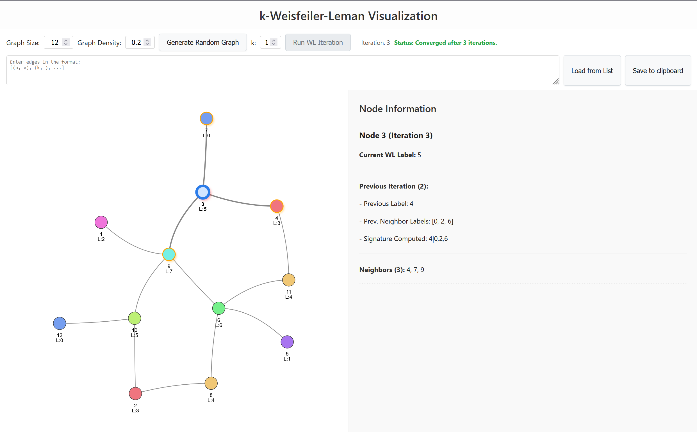
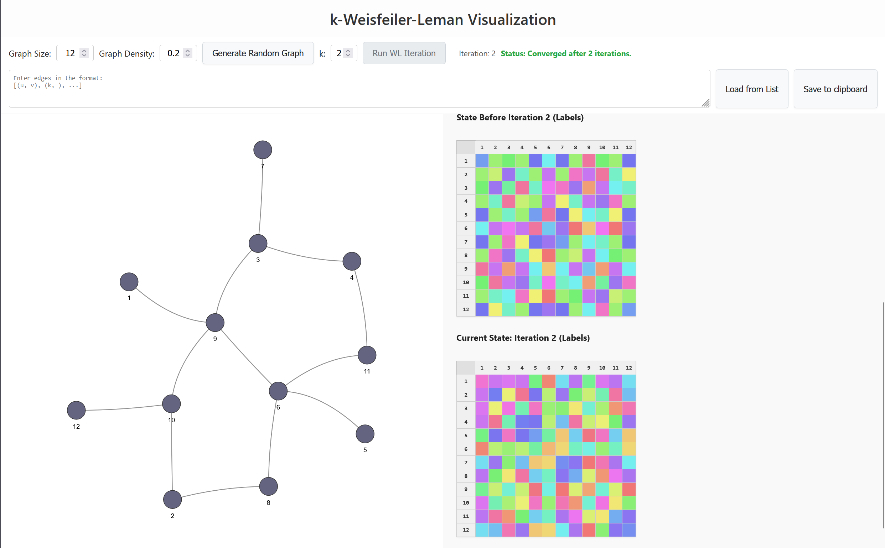

# ✨ Interactive k-Weisfeiler-Leman Visualization ✨

[](https://opensource.org/licenses/MIT)

A web-based tool for visualizing the k-Weisfeiler-Leman (k-WL) graph labeling algorithm, a procedure used in graph isomorphism testing in graph neural networks. This application interactively demonstrates the 1-WL and 2-FWL algorithms step-by-step.




## 🚧 In progress
This project is a work in progress. The current implementation is functional but may have some bugs and limitations. Feel free to report any issues you encounter.

## 📖 Overview

The Weisfeiler-Leman algorithm iteratively refines labels (colors) assigned to nodes or tuples of nodes in a graph based on the labels of their neighbors. If two graphs are isomorphic, they will produce the same final labeling counts (or histogram) after the algorithm converges. This tool helps in understanding how these labels evolve over iterations for k=1 (node labeling) and k=2 (tuple labeling).

This visualization is aimed at educational purposes, making it easier to grasp the concepts behind the WL / FWL algorithm and its applications in graph theory and machine learning.

## 🚀 Features

* **Random Graph Generation:** Creates random graphs using the Erdős-Rényi model with a specified number of nodes and edge probability. You can adjust the parameters to generate different graphs.
* **k-WL:** Supports both 1-WL and 2-FWL algorithms.
* **Step-by-Step Iteration:** Run the WL / FWL algorithm one iteration at a time to observe changes.
* **Interactive Visualization:** Uses `vis.js` for smooth graph rendering and interaction.
* **Detailed Info Panel:** Select a node to see:
    * Its current label.
    * The signature computed in the previous iteration that led to the current label.
    * Neighbor information (for 1-WL) or participating tuples (for 2-FWL).
* **Convergence Detection:** The application indicates when the algorithm has stabilized (labels no longer change).
* **Customizable Graphs:** Load your own graphs by giving a list of edges
* **Export Graph:** Save to clipboard the current graph in a format that can be used to load it again in the application.

## 🛠️ Getting Started

To run this application locally, you need Python 3 installed.

1.  **Clone the repository:**
    ```bash
    git clone https://github.com/hugo-hamon/k-WL.git
    cd k-WL/src
    ```

2.  **Start a local web server:**
    This project uses JavaScript Modules (`import`/`export`). Modern browsers require modules to be served over HTTP(S) due to security restrictions (CORS policy). A simple Python web server works perfectly for this.
    ```bash
    python3 -m http.server
    ```

3.  **Open the application:**
    The server will typically start on port 8000. Open your web browser and navigate to:
    [http://localhost:8000](http://localhost:8000)

    You should now see the k-WL visualizer interface.

## 🎮 How to Use

1.  **Generate Graph:** Click `Generate New Graph` to start.
2.  **Select k:** Choose `1` or `2` for the WL-variant.
3.  **Iterate:** Click `Run WL Iteration` to advance the algorithm one step. Observe the visualization changes.
4.  **Inspect:** Click a node to see its current label and related info in the right panel.
5.  **Repeat:** Continue iterating until the status shows "Converged".

## 💡 Future Work Ideas
* 2-WL with tuple labels (currently only supports 2-FWL).


## 👀 Contributing

Contributions, issues, and feature requests are welcome! Feel free to check the [issues page](https://github.com/hugo-hamon/k-WL/issues) (if applicable) or submit a pull request.

## 📜 License

Distributed under the MIT License. See `LICENSE` file for more information.